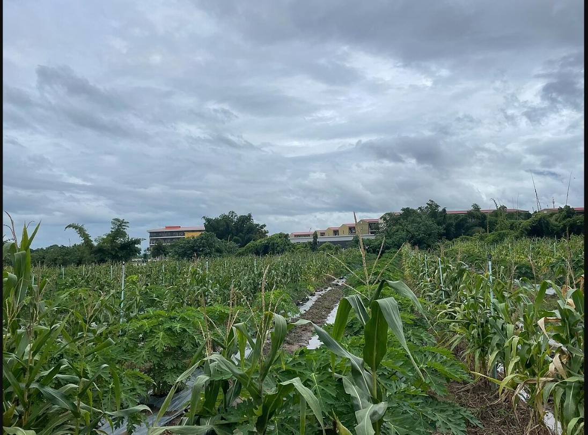
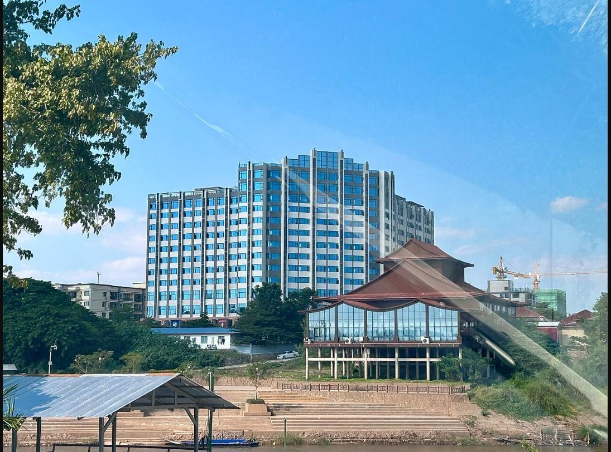
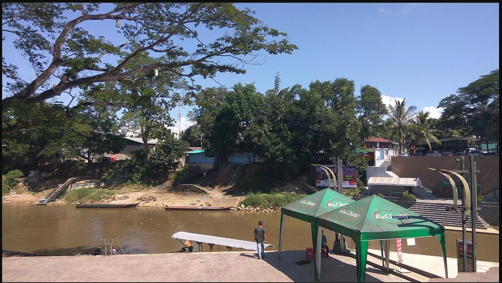
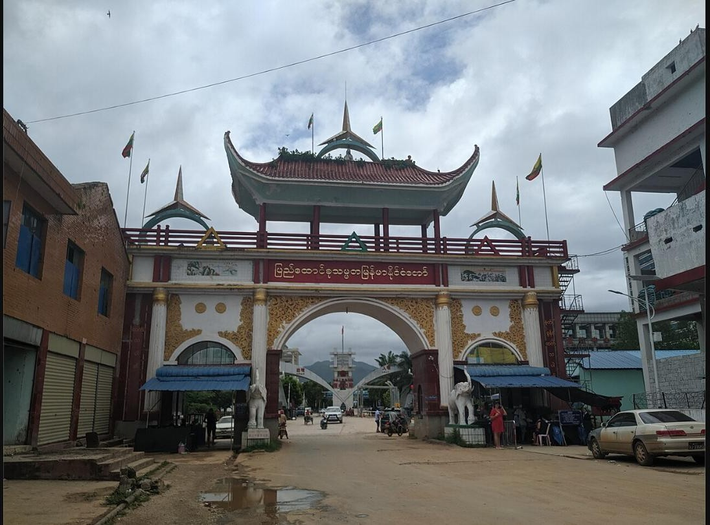
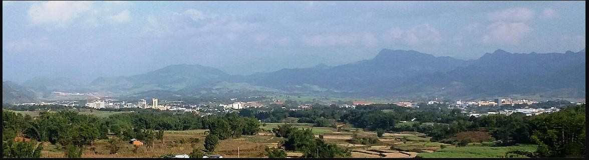
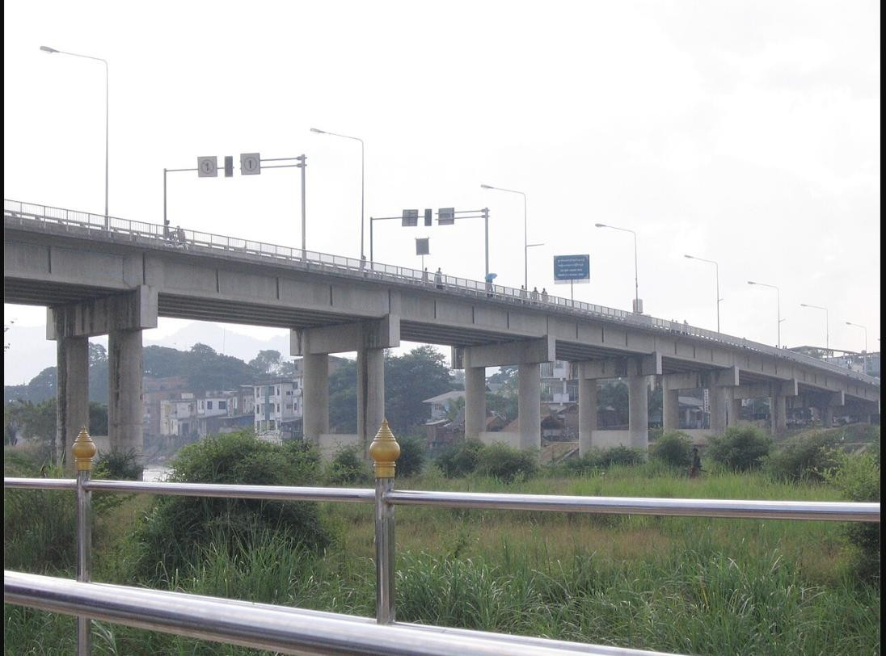
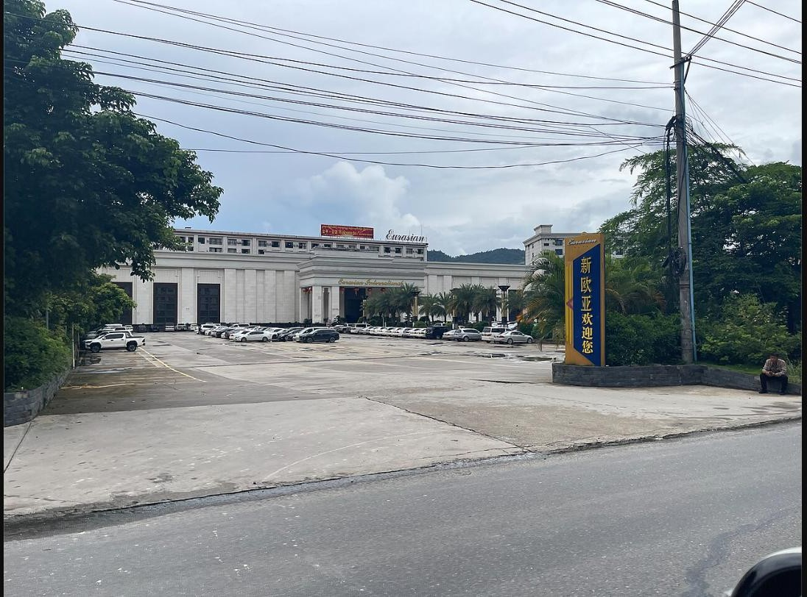

# Exercise 1 - Where Was This Taken?

Reverse image search and geolocation exercise (groups of 3-4)

Seven photographs, all taken in Myanmar. Every one of them is connected to scam compounds, the smuggling of people across borders, or the trafficking of workers into compounds.

## Your task

For each image, find out:

1. **Where was it taken?** Give the place name and coordinates in decimal degrees (for example 16.6900, 98.5150). Be as precise as you can: the compound, gate, bridge or crossing, not just the township.
2. **How did you get there?** Reverse image search, a caption you found, a visual clue, satellite view. Write down the method.
3. **How confident are you?** High, moderate or low.
4. **Bonus:** what is the relevance of this place to recruitment into scam compounds?

Write everything in section 1 of your group worksheet. Split the images between the members of your group.

## How to reverse-search an image

- Right-click the image and choose **Search image with Google** (Google Lens), or
- save or screenshot the image and upload it at https://images.google.com (camera icon), https://yandex.com/images or https://www.bing.com/visualsearch
- If a search returns nothing, crop the image to its most distinctive part and search again, then confirm the place on Google Maps satellite view or Google Earth.
- Finding a source page is step one, not the answer. Put the pin on the map yourself and state how sure you are.

## Rules

- VPN on, research accounts only.
- Do not upload the images to AI chatbots from a work account.
- Ask a facilitator if you get stuck.

## The images

### img01

### img02

### img03

### img04

### img05

### img06

### img07

---

Images: Wikimedia Commons, reused under CC BY / CC BY-SA / CC0 licences; full attribution is given to participants after the exercise.
